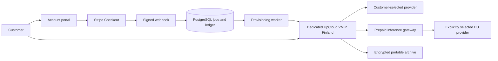

# Sovereign Agent Cloud

A small control service for paid, dedicated UpCloud VMs running **unmodified OpenClaw**. Customer context stays in a portable OpenClaw state directory. Customers can bring a model-provider key or purchase separately metered inference credit.

**Status: implemented with local database/runtime verification; not a deployed or launch-approved service.** Checkout is disabled, managed models are unverified, and real cloud/payment/messaging/export acceptance evidence is deliberately unset. See `docs/VALIDATION.md` for precisely what has been exercised.

## What is included

- Verified email access, a small account portal, signed Stripe webhooks, durable PostgreSQL jobs, account-bound checkout, and subscription lifecycle handling.
- One UpCloud VM per trusted owner/group, cloud-init bootstrap, DNS-only Cloudflare records, HTTPS, browser-based stock OpenClaw onboarding, and owner device pairing.
- BYOK isolation plus an OpenAI-compatible EU inference gateway, €10 prepaid top-ups, versioned 25%-markup rates, atomic spending reservations, refunds/disputes, and usage reconciliation.
- Encrypted complete state exports, seven daily Finnish backups, migration instructions, suspended-account export, retention/deletion jobs, and rollback tooling.
- Public OpenAPI contract, Docker deployments, PostgreSQL integration tests, and CI/image publishing workflows.

The marketing website is included at **`/welcome/`**, with the existing account portal at **`/`**. Its purchase link passes the selected inference mode to the portal; verified email access and server-bound Checkout Sessions remain the only purchase path. Read [the website handoff](docs/WEBSITE-INTEGRATION.md) and [launch materials](docs/marketing/README.md). Stripe products still need configuration; the previous standalone Payment Link suggestion is superseded.

## Local development

Requires Node 24+, Docker, and PostgreSQL 17. No cloud credentials are required for the integration suite; it uses local PostgreSQL and fake payment/cloud adapters.

```sh
npm ci
docker run --name sac-postgres-test -e POSTGRES_PASSWORD=sac-local-test-only \
  -e POSTGRES_DB=sac_test -p 127.0.0.1:55432:5432 -d postgres:17-alpine
npm run typecheck
npm test
npm run build
# Optional real pinned-OpenClaw encrypted export/restore smoke test:
docker build -t sovereign-agent-cloud:local .
scripts/local-runtime-smoke.sh
```

Override `TEST_DATABASE_URL` for your own disposable test database. **Tests drop and recreate its public schema. Never point tests at a production database.**

To configure deployment, run `node scripts/init-secrets.mjs`, edit ignored `.env`, and follow [operations](docs/OPERATIONS.md). Existing secret files are not overwritten. Do not enable live checkout until every [acceptance gate](release-evidence.json) has recorded evidence.

## Architecture



The hosting operator has administrative VM access. A family/company subscription is one trusted group, not separate private member accounts. iMessage requires a connected Mac. The initial credit-model adapter targets Scaleway Paris; a Finnish Verda route can be selected when verified. Providers/countries are never silently substituted.

[API](docs/openapi.json) · [Restore elsewhere](docs/RESTORE.md) · [Operations](docs/OPERATIONS.md) · [Validation](docs/VALIDATION.md)

Apache-2.0. OpenClaw and other dependencies retain their own licenses.
